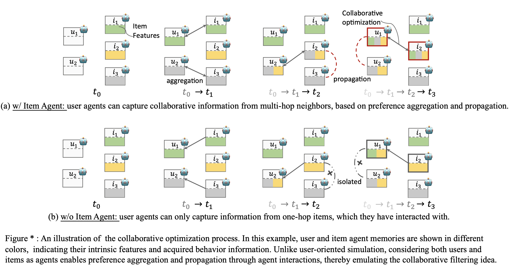

# AgentCF

## 🚀 Quick Start





1. Write your own OpenAI API keys into ``agentcf/props/AgentCF.yaml``, such as ``api_key_list: ['xxx', 'xxx']``.
2. Optimize user agents and item agents on CDs dataset.
    ```bash
    cd agentcf/
    export api_base="Your openai.api_base"
    python run.py -m AgentCF -d CDs-100-user-dense --train_batch_size=20 --eval_batch_size=200 --max_his_len=20 --MAX_ITEM_LIST_LENGTH=20 --epochs=1 --shuffle=False --api_batch=20 --test_only=False
    ```
3. Evaluate (i.e. interaction inference)
    ```bash
    cd agentcf/
    export api_base="Your openai.api_base"
    python run.py -m AgentCF -d CDs-100-user-dense --train_batch_size=20 --eval_batch_size=200 --max_his_len=20 --MAX_ITEM_LIST_LENGTH=20 --epochs=1 --shuffle=False --api_batch=20 --test_only=True
    ```
 4. We can directly load the pre-trained user agents and item agents on CDs dataset.
    ```bash
    cd agentcf/
    export api_base="Your openai.api_base"
    python run.py -m AgentCF -d CDs-100-user-dense --train_batch_size=20 --eval_batch_size=200 --max_his_len=20 --MAX_ITEM_LIST_LENGTH=20 --epochs=1 --shuffle=False --api_batch=20 --test_only=True --loaded=True --saved=False --saved_idx=1000
    ```
 5. You can choose different prompting strategies, including Basic Prompting Strategy (B), sequential-enhanced (B+H), and retrieval-augmented (B+R), by setting the evaluation mode in the ``agentcf/props/AgentCF.yaml`` file as ``evaluation: basic/rag/sequential``
